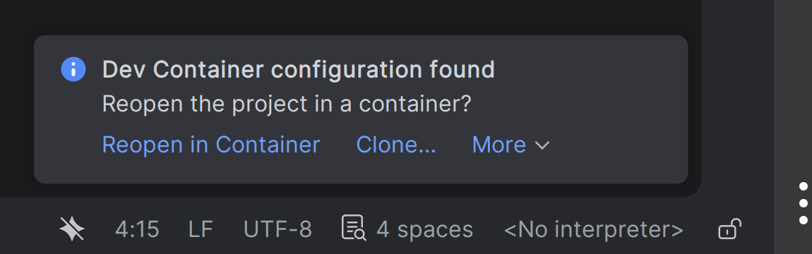
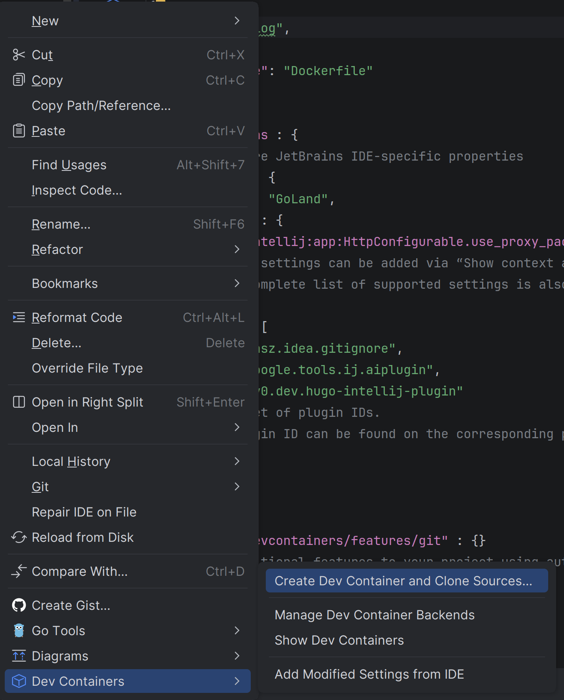
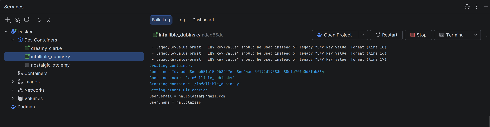
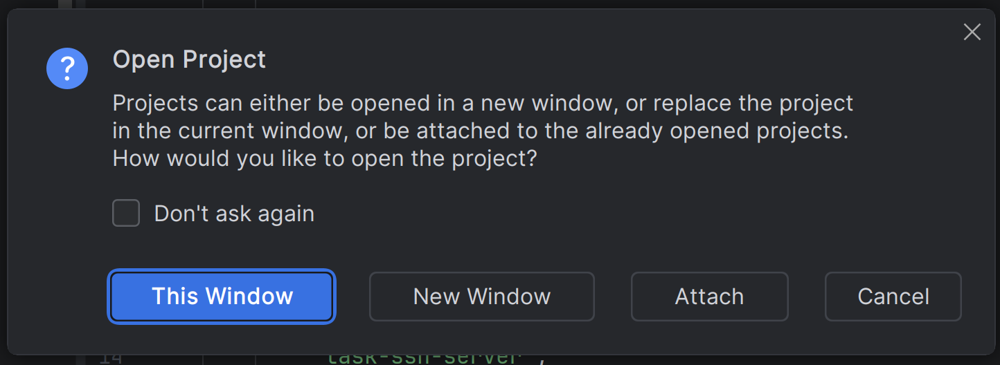
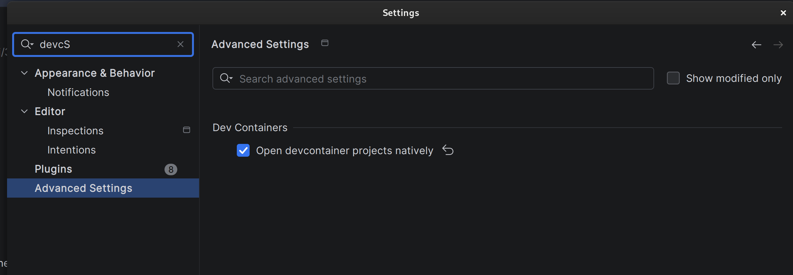

+++
title = "在開發流程中使用 Dev Containers"
date = 2026-04-20
draft = false
categories = ["Jetbrains", "Linux"]
+++

這篇短文簡要介紹了我如何在開發流程中採用 Dev Container。如果你希望在使用現代 IDE 的同時，又能從管理不同程式語言/框架的複雜開發環境中解脫出來，Dev Containers 會是一個不錯的選擇。

如果你是一名需要同時處理多個專案的軟體開發人員，有時可能需要在不同版本的程式語言/框架之間切換。雖然現代程式語言支援多版本管理器，例如 NodeJS [NVM](https://github.com/nvm-sh/nvm) 和 Python 的 [Virtual Environment](https://docs.python.org/3/library/venv.html)，但使用者仍需仔細設定/選擇環境，以避免改動全域的 Runtime。[asdf](https://www.google.com/search?q=https://github.com/asdf-vm/asdf) 是一個非常棒的全能解決方案，但它需要為每個專案進行額外設定。

先前，我解決這種複雜性的方法是使用 Container。一般而言，我常用的專案結構如下：

```text
 /path/to/project
 |-- deployment                   # 切換不同的目錄以使用不同的環境
 |   |-- production
 |   |   `-- docker-compose.yaml
 |   `-- development
 |       `-- docker-compose.yaml
 |-- dockerfile                   # 針對不同環境的實際 Dockerfiles
 |   |-- production
 |   |   `-- Dockerfile
 |   `-- development
 |       `-- Dockerfile
 `-- src
```

對於本地環境開發，Source Code 會透過 `docker-compose.yaml` 和 `Dockerfile` 掛載到Container中，並安裝所有必要的 Language Runtime 與套件。因此，我可以在 IDE 中編輯程式碼並立即得到最新結果，而無需在機器上安裝所有 Dependencies 。然而，IDE 本身仍需要 Runtime。例如，在 JetBrains 系列 IDE 中，如果沒有這些環境，Syntax Highlighting 和 Debuggin 功能將無法運作，這使得 IDE 變成了單純高度消耗資源的文字編輯器。雖然有一些遠端開發的解決方案，但它們是實際上是透過 SSH 實作（如 [VSCode](https://code.visualstudio.com/docs/remote/remote-overview) 或 [JetBrains](https://www.jetbrains.com/guide/remote/) 的方案），可能需要額外的設定。

幸運的是，像 VSCode 和 JetBrains 這樣的 IDE 現在都增加了對 [Dev Containers](https://containers.dev/) 的支援。與遠端開發不同，Dev Containers 會在 Container 內運行 IDE。這使得 IDE 可以直接使用 Container 中的環境，進而免去了使用者在宿主機上安裝特定 Runtime 的麻煩。

使用 Dev Containers 後，專案結構變為：

```text
 /path/to/project
 |-- .devcontainer
 |   |-- devcontainer.json        # 定義在 Dev Containers 中運行時 IDE 和Container相關的設定 
 |   `-- Dockerfile               # Dev Container 定義文件
 |-- deployment                   # 切換不同的目錄以使用不同的環境
 |   `-- production
 |       `-- docker-compose.yaml
 |-- dockerfile                   # 針對不同環境的實際 Dockerfiles
 |   `-- production
 |       `-- Dockerfile
 `-- src
```

`devcontainer.json` 的內容也非常直觀。例如，我在使用  [Hugo](https://gohugo.io/) 撰寫本部落格時，使用的設定如下：

```json
{
  "name": "hugoblog",
  "build": {
    "dockerfile": "Dockerfile"
  },

  "customizations" : {
    "jetbrains" : {
      "backend" : "GoLand",
      "settings" : {
        "com.intellij:app:HttpConfigurable.use_proxy_pac": true
      },
      "plugins": [
        "mobi.hsz.idea.gitignore"
      ]
    }
  },
  "features": {
    "ghcr.io/Dev Containers/features/git" : {}
  }
}
```

該設定啟動了一個名為 `hugoblog` 的 Dev Container，它是根據 `.devcontainer` 目錄下的 Dockerfile 構建的。`customizations` Key 包含特定於 IDE 的設定（VSCode 有不同的選項）。對於 JetBrains IDE，使用者可以指定要在 Dev Containers 中運行的 IDE 以及預裝的 Plugins（獨立於宿主機上安裝的 Plugins）。在這個例子中，它們分別是 `GoLand` 和 `gitignore`。此外，一些 [features](https://containers.dev/features) 也可以直接添加到 Dev Containers 中，而無需在 Dockerfile 中定義。

Dev Containers 的 Dockerfile 則沒有特殊限制。例如，對於 `hugoblog` ，我使用：

```dockerfile
FROM debian:13.2

ARG DEBIAN_FRONTEND=noninteractive
RUN apt-get update && \
    apt-get install -qq -y  \
        git \
        dpkg-dev \
        curl \
        locales \
        wget

# 為 lb 和套件安裝設置語言環境 (locale)
RUN sed -i '/en_US.UTF-8/s/^# //g' /etc/locale.gen && \
    locale-gen
ENV LANG en_US.UTF-8
ENV LANGUAGE en_US:en
ENV LC_ALL en_US.UTF-8

RUN wget https://github.com/gohugoio/hugo/releases/download/v0.157.0/hugo_extended_withdeploy_0.157.0_linux-amd64.deb && \
    dpkg -i hugo_extended_withdeploy_0.157.0_linux-amd64.deb

ENTRYPOINT ["sleep", "infinity"]
```

該 `Dockerfile` 僅包含該專案所需的必要套件，而不包含 IDE 特定的套件。

要運行 Dev Containers，對於 JetBrains IDE，如果專案包含 `.devcontainer`，它們會透過右下角的引導工具讓使用者運行 Dev Containers：




使用者也可以透過右鍵點擊 `.devcontainer/devcontainer.json` 並選擇 `Dev Containers` 來運行它們：



隨後，使用者將看到 IDE 開始基於 Dockerfiles 建置 Container、添加 features、安裝並設定新的 IDE 實例。



建置完成後，Dev Containers 將啟動，並要求使用者切換到新的 IDE：



掛載或複製的專案將位於 `/IdeaProjects` 目錄下。Container 也可以透過 Container Runtime查看（例如 `docker ps`）。如果 Dockerfile 或 Base Container 中包含 shell，使用者還可以進入 Dev Containers 執行命令。在我的情境中，我透過 `hugo server --bind 0.0.0.0` 執行帶有即時更新的 `hugo` Server，並在瀏覽器中查看修改後的內容。

另一個重大突破是，目前 JetBrains IDE 支援將 Dev Containers 與宿主機上安裝的 IDE 整合。一旦使用者啟用了「Open Dev Container projects natively」，下次開啟專案時，Dev Containers 將自動載入到宿主機的 IDE 上。這意味著使用者不需要手動切換 IDE，可以使用宿主機 IDE 上的設定和 Plugins 。



# 缺點

根據我使用至目前為止的經驗，Dev Container 在 JetBrains IDE 中仍處於早期階段：

1. 並非所有 Property 都能正常運作。例如，`forwardPorts` 應該將 Container 的連接埠暴露至宿主機上，進而允許宿主機上的瀏覽器透過 `localhost` 存取服務。然而，在 JetBrains IDE 中，使用者會在 UI 上看到 Dev Containers 連接埠已暴露，但實際上並沒有發生（可以透過 `docker inspect` 確認）。使用者仍需使用 Container 的 Bridge IP 來存取它們（可透過 `docker inspect` 找到）。
2. 只有 Docker 是能正常運作的 Runtime。雖然 JetBrains 支援 [Podman](https://podman.io/) 作為 Container Runtime，但實際運行時會有一些功能沒有被設定。例如，沒有像 Docker Container 那樣的 Bridge IP，導致使用者沒有能夠存取 Container 上的服務的替代方式。
3. 檔案權限問題。在 Dev Containers 中透過 Shell 建立的檔案，以及從宿主機檔案系統複製過去的檔案，在 Container 內使用的是 root 權限。使用者需要手動更改這些檔案/目錄的擁有者或權限，才能在 IDE 中進行編輯。

# 結語

儘管 Dev Containers 仍處於早期階段且存在一些不足，但它確實能幫助使用者簡化開發環境的管理工作。在我的情境中，我已經不在 [我的 OS](https://www.google.com/search?q=/posts/2026_apr_19_choose_os/) 上安裝任何程式語言的 Runtime / 編譯器。相反地，我所有的開發工作都在 Dev Containers、[Distrobox](https://distrobox.it/)（用於搭建能夠快速在 CLI 上進行測試的環境）和 [Vagrant](https://developer.hashicorp.com/vagrant)（用於需要完整 Linux Kernel 的專案）中完成。

如果你對 Dev Containers 感興趣，我建議從 IDE 的官方網站（如 [JetBrains](https://www.jetbrains.com/help/idea/connect-to-devcontainer.html)）和 [官方 Reference ](https://containers.dev/implementors/json_reference/) 開始著手。