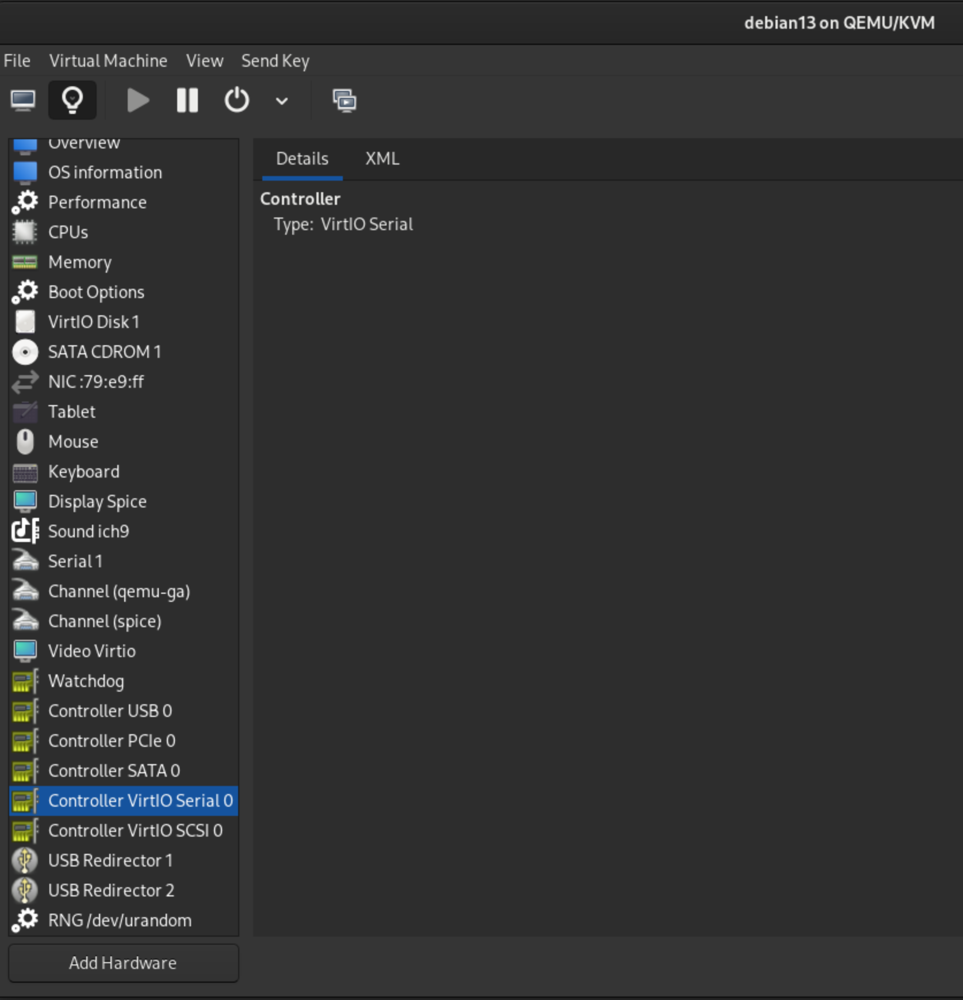
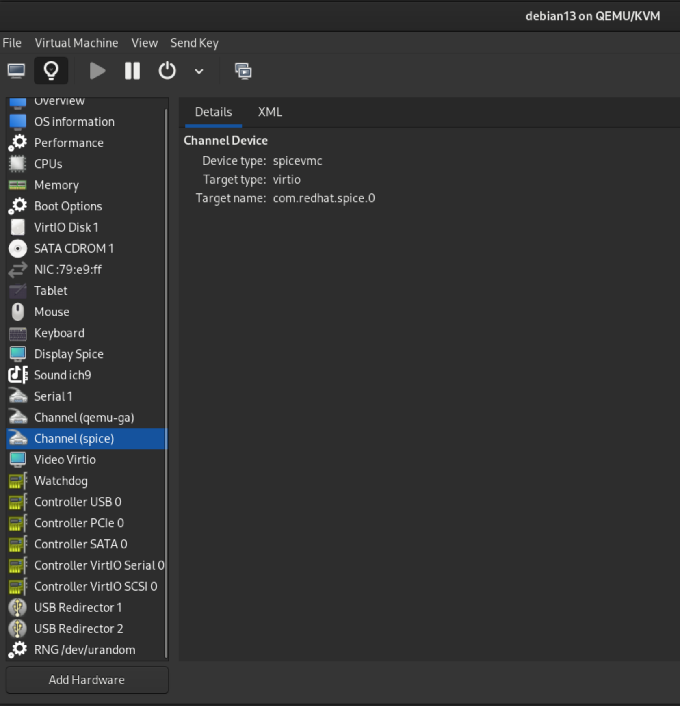

+++
title = "Problem with Spice and KDE Guest VMs"
date = 2026-10-04
draft = false
categories = ["Linux"]
+++

If you are running desktop environments in VMs and are unable to share clipboard, this topic could help.

# Background

I encountered this issue while running [Kali Linux](https://www.kali.org/) in virt-manager/QEMU based VMs. When setting up desktop environment in virt-manager, if you need to share clipboard between host machine and guest VM, setup spice with the steps according to [the topic](https://www.spice-space.org/spice-user-manual.html#agent) is necessary:
1. Add a virtuio serial device
   

       
   

2. Add a spicevmc channel
   

       
   

Although some guides suggest installing `spice-vdagent` on host machines, it's generally unnecessary to modern distributions such as Ubuntu 26.04+ and Debian 13+. 

However, if your guest VMs run KDE, you might encounter some strange behaviors. In my case, copying text from the host(Debian 13) to guest(Kali 2026.2, Debian 13-based) worked, but copying in the opposite direction didnt'. It seems to be caused by [how different desktop environments handle their Wayland Compositor implementation](https://bugzilla.redhat.com/show_bug.cgi?id=2016563#c32). Resolving this requires upstream patch in KDE, which has not yet been addressed. 

# Resolution

My recommendation are:
- Switching desktop environments. In my testing, neither GNOME nor XFCE suffered this issue.
- Switching hypervisors. For instance [VitualBox](https://www.virtualbox.org/). Note that running Virutalbox on Linux relies on KVM, which will cause conflict with QEMU. It could bring more overhead to users.
